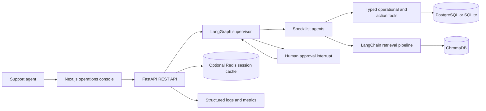
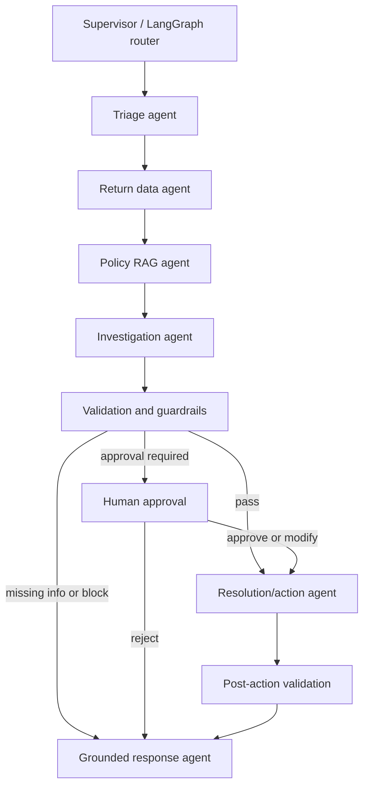
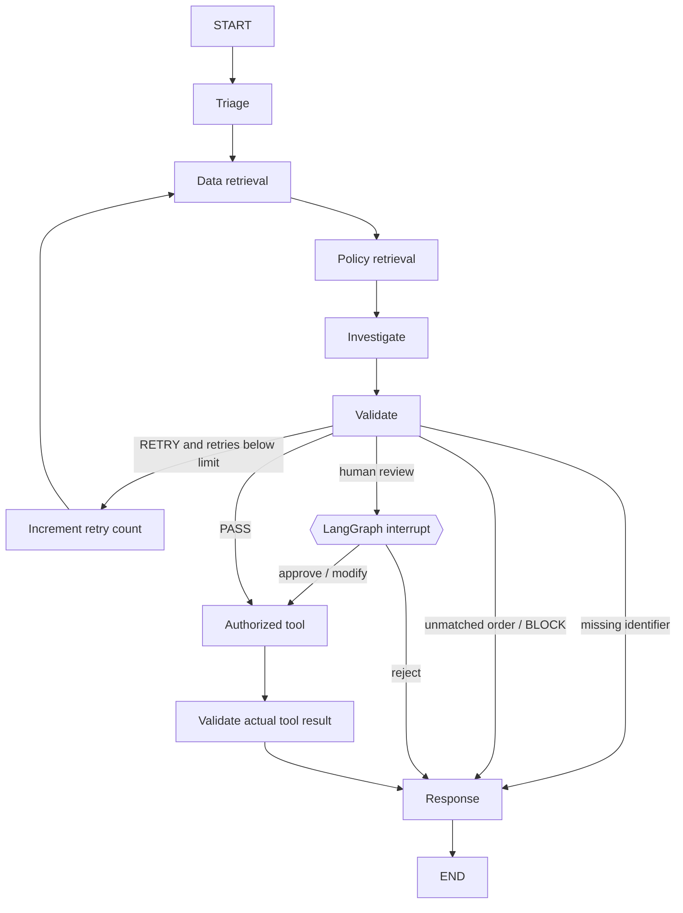
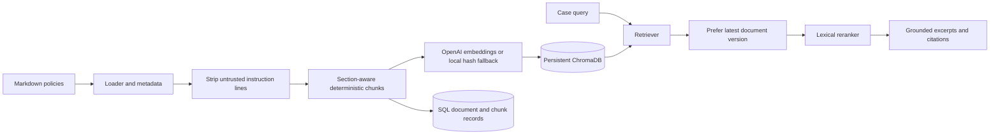

# Agentic Returns Exception Decision Assistant

A full-stack returns-operations console backed by a multi-agent LangGraph workflow. It combines verified synthetic order and customer records with cited policy retrieval, pauses consequential decisions for a human, and records only actions confirmed by explicit tools.

## Project Overview

Retail returns are usually routine, but damaged goods, late requests, missing items, delivery disputes, pending refunds, high-value products, and risk indicators require evidence gathering and careful escalation. This project demonstrates an auditable assistant for support agents, returns specialists, and operations managers.

The application is runnable without an OpenAI key or production data. OpenAI chat and embeddings activate when configured; deterministic triage, local hashing embeddings, lexical retrieval, SQLite, and synthetic records keep the demo usable offline.

## Objectives

- Classify return requests and extract only identifiers present in the request.
- Retrieve authoritative operational data through typed database tools.
- Retrieve versioned policy sections with citations.
- Investigate a case, produce a structured recommendation, and validate evidence.
- Pause consequential actions for an authorized reviewer.
- Execute approved actions through idempotent tools; tools create review/case records and do not transfer money or reserve inventory.
- Persist workflow state, approvals, audit entries, and metrics.

## Architecture



## Multi-Agent Architecture



### Agent Responsibilities

- **Supervisor:** LangGraph owns routing, state transitions, bounded retries, and approval interruption. The supervisor does not directly execute business tools.
- **Triage:** Pydantic structured classification. Deterministic extraction is authoritative for IDs; optional LangChain/OpenAI structured output can refine category and priority.
- **Return data:** Queries the synthetic OMS, customer, returns, tracking, payment, inventory, return-history, and support-case tables. Tool outputs, not the model, are the operational facts.
- **Policy RAG:** Retrieves versioned policy chunks, reranks lexical matches, and returns citations and excerpts.
- **Investigation:** Combines tool evidence, case claims, delivery timing, customer history, payment state, inventory, and citations into concise findings.
- **Resolution/action:** Chooses an explicit business tool. Requests for refunds and other consequential changes are approval-gated and recorded as review cases only.
- **Validator:** Blocks unknown orders and unauthorized actions; requires evidence and citations; routes missing citations through a bounded retry and then review.
- **Response:** Separates known facts, evidence, policy, recommendation, completed action, pending approval, and sources. It never reports an unconfirmed action as complete.

## LangGraph Workflow



The graph uses a LangGraph `MemorySaver` checkpoint while running. A serialized workflow snapshot, including concise evidence and pending approval, is persisted in the application database; if an in-memory checkpoint is unavailable after restart, approval recovery restores that snapshot and re-enters the graph. Idempotency keys protect tool execution during recovery. Retries are capped by `MAX_WORKFLOW_RETRIES` (default 2).

## RAG Architecture



Each chunk includes document ID, title, source, category, page, section, version, effective date, and a stable ID. Ingestion is a separate command; backend startup does not regenerate embeddings. The loader strips known instruction-injection lines. Retrieved content is evidence only and cannot alter tool authorization or approval rules. A superseded 45-day draft is included as a test fixture; retrieval prefers the current policy version.

## Human Approval

```mermaid
sequenceDiagram
  participant Agent as LangGraph workflow
  participant DB as Persistent case store
  participant Reviewer as Operations reviewer
  participant Tool as Authorized action tool
  Agent->>DB: Save pending workflow and evidence
  Agent-->>Reviewer: Show proposed action, sources, confidence, impact
  Note over Agent: Workflow pauses at interrupt; no action has run
  Reviewer->>Agent: Approve, reject, or modify
  Agent->>DB: Record reviewer decision and audit event
  alt Approved or modified
    Agent->>Tool: Execute with idempotency key
    Tool-->>Agent: Authoritative recorded result
  else Rejected
    Agent-->>DB: Preserve rejection; execute no action
  end
  Agent->>Agent: Validate result and compose cited response
```

Approval is mandatory for refunds, high-value items, policy exceptions, damage exceptions, fraud-risk indicators, replacements/compensation, and low-confidence outcomes. The demo records a refund-review request, not a payment transaction.

## Technology Stack

- **Frontend:** Next.js 15, React, TypeScript, Tailwind CSS, Lucide icons.
- **API:** FastAPI, Pydantic v2, SQLAlchemy.
- **Agents:** LangGraph state graph and LangChain integration with configurable OpenAI chat/structured output.
- **RAG:** LangChain-compatible embeddings, ChromaDB, local deterministic embeddings fallback.
- **Persistence:** PostgreSQL in Compose; SQLite by default for local development; optional Redis for short-term session cache.
- **Observability:** JSON-ready structured logging, workflow and tool audit records, request IDs, metrics endpoint, optional LangSmith tracing.
- **Quality:** Pytest, synthetic evaluation dataset, GitHub Actions, Docker Compose.

## RAG and Data Sources

Operational tools read `customers`, `orders`, `order_items`, `returns`, `return_items`, `payments`, `shipments`, `inventory`, and `support_cases`. Policy documents are under `backend/knowledge_base/`; 30+ realistic sections cover returns, refund processing, damaged goods, risk reviews, shipments, inventory, SOP, injection defense, and a superseded policy conflict.

## Database Design

SQLAlchemy defines `users`, `sessions`, `messages`, `customers`, `orders`, `order_items`, `returns`, `return_items`, `payments`, `shipments`, `inventory`, `support_cases`, `workflows`, `agent_runs`, `tool_calls`, `documents`, `document_chunks`, `approvals`, `audit_logs`, `evaluations`, and `idempotency_records`. Tables are initialized with SQLAlchemy `create_all` at API startup. This demo does not yet include Alembic migration history.

## Folder Structure

```text
.
├── .env.example
├── .github/workflows/ci.yml
├── backend/
│   ├── app/
│   │   ├── agents/       # triage, retrieval, investigation, action, validation, response
│   │   ├── api/          # chat, agent, documents, workflow, approval, health/metrics
│   │   ├── config/       # environment-backed settings
│   │   ├── graph/        # typed state, nodes, conditional edges, compiled graph
│   │   ├── models/       # Pydantic contracts and SQLAlchemy tables
│   │   ├── prompts/      # role, grounding, constraints, failure behavior
│   │   ├── rag/          # loader, chunking, embeddings, Chroma, reranker, indexer
│   │   ├── services/     # LLM, memory, approval and workflow persistence
│   │   └── tools/        # database, API boundary, and idempotent action tools
│   ├── evaluation/dataset/  # 40 synthetic quality cases
│   ├── knowledge_base/      # versioned Markdown policies
│   ├── scripts/             # seed and ingest entry points
│   ├── tests/
│   ├── Dockerfile
│   └── requirements.txt
├── docker-compose.yml
├── frontend/
│   ├── app/             # investigation console and /admin
│   ├── components/
│   ├── lib/              # API client
│   ├── types/
│   └── Dockerfile
└── README.md
```

## Installation and Environment

From the repository root:

```bash
cp .env.example .env
python3 -m venv backend/.venv
backend/.venv/bin/pip install -r backend/requirements.txt
cd frontend && npm ci && cd ..
```

`OPENAI_API_KEY` is optional for the local fallback. For production, provide it through Codespaces secrets or deployment secret management, never source control. Configure `DATABASE_URL`, `REDIS_URL`, `CHROMA_HOST`, and `CHROMA_PORT` for external services. LangSmith tracing is optional and only enabled when both tracing and API-key environment settings are present. `SECRET_KEY` is reserved for a future authentication integration.

## Run Locally

Initialize and seed the SQLite database, then ingest policies:

```bash
PYTHONPATH=backend backend/.venv/bin/python backend/scripts/seed_database.py
PYTHONPATH=backend backend/.venv/bin/python backend/scripts/ingest_documents.py
```

Start the backend in one terminal:

```bash
PYTHONPATH=backend backend/.venv/bin/uvicorn app.main:app --app-dir backend --host 0.0.0.0 --port 8001 --reload
```

Start the frontend in another terminal:

```bash
cd frontend
NEXT_PUBLIC_API_URL=http://localhost:8001 npm run dev
```

Open `http://localhost:3000`. The backend API and OpenAPI docs are at `http://localhost:8001` and `http://localhost:8001/docs`.

## Docker

Set local Compose variables in `.env` (the example contains a non-production local-only database password), then run:

```bash
docker compose up --build
```

Seed and index inside the backend container:

```bash
docker compose exec backend python scripts/seed_database.py
docker compose exec backend python scripts/ingest_documents.py
```

The stack includes PostgreSQL, Redis, ChromaDB, FastAPI, and Next.js. Persistent named volumes retain database, cache, and vector data.

## API Documentation

- `POST /api/chat` and `POST /api/agent/run`: start an investigation.
- `POST /api/approval/{workflow_id}`: approve, reject, or modify a paused action.
- `GET /api/workflows/{workflow_id}` and `GET /api/sessions/{session_id}`: retrieve persisted state/history.
- `POST /api/documents/upload`: upload a bounded Markdown/plain-text policy file.
- `POST /api/documents/ingest`: index knowledge-base and uploaded sources.
- `GET /api/health` and `GET /api/metrics`: readiness and operational/evaluation metrics.

Example request:

```bash
curl -X POST http://localhost:8001/api/chat \
  -H 'Content-Type: application/json' \
  -d '{"message":"My order ORD1002 was delivered 37 days ago and I want a refund."}'
```

The response includes workflow ID/status, intent/classification, confidence, evidence, policy citations, proposed action, completed and pending actions, and a customer-ready grounded response.

## Sample Cases

The interface includes one-click scenarios for damaged `ORD1001`, 37-day late `ORD1002`, wrong item `ORD1003`, pending refund `ORD1004`, high-value `ORD1005`, late damage, and a missing order ID. Synthetic records also cover lost shipments, missing items, duplicates, risk flags, empty retrieval, simulated tool failure, injection text, and conflicting policy versions.

## Testing and Evaluation

```bash
cd backend
PYTHONPATH=. ./.venv/bin/python -m pytest -q
PYTHONPATH=. ./.venv/bin/python -m evaluation.runner
```

The 40-case evaluation set contains 10 standard, 5 ambiguous, 5 missing-information, 5 simulated tool-failure, 5 prompt-injection, 5 policy-conflict, and 5 approval cases. It writes `backend/evaluation/report.md` and persists evaluation scores. Metrics include citation rate, escalation correctness, latency, tool success, and classification accuracy when labels are available. The test suite does not require network APIs or a real OpenAI key.

## Deployment and Observability

The backend Docker image can deploy to Azure Container Apps, AWS, Render, or Railway with PostgreSQL and Chroma endpoints supplied by environment. The frontend uses Next.js standalone output for Vercel/container deployment. Production deployments should add managed secrets, authentication/authorization, database migrations, durable shared LangGraph checkpoints, rate limiting, and real OMS/payment adapters.

Request IDs are returned in `X-Request-ID`. Structured log fields and database audit records include workflow/session, agent/tool, latency, status, error, retrieval count, and human-review status without logging credentials. LangSmith is optional. OpenTelemetry instrumentation can be added behind the existing service boundaries.

## Security

- No API key is committed; `.env` is ignored and `.env.example` contains configuration names only.
- Input contracts bound request length; uploads allow Markdown/text only and enforce a byte cap.
- Operational records are only accessed through typed tools. The LLM cannot write application tables.
- Tool actions require idempotency keys; money transfer and inventory reservation are not implemented.
- Untrusted policy instructions are sanitized and policy versions are resolved before citation.
- Risk flags are never treated as fraud determinations or exposed in customer-facing response text.
- CORS is configurable. Authentication and role authorization are integration points, not claims of an implemented identity provider.

## Limitations and Future Enhancements

This is a realistic synthetic-data reference implementation, not a live retailer integration. Payment/refund and replacement tools create review records only. Local LangGraph checkpoints are in-memory; persisted workflow snapshots allow approval recovery, but production should use a shared durable checkpointer. The UI displays recent operational metrics, but does not replace a full tracing or evaluation platform. Next steps include Alembic migrations, production identity and role checks, managed checkpoint storage, OpenTelemetry exporters, calibrated retrieval evaluation, and adapters with sandboxed OMS/carrier/payment APIs.
